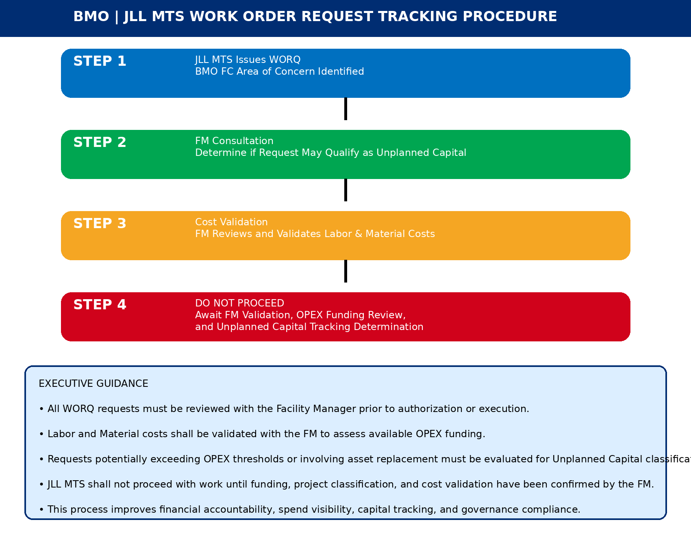

# Same Goal, Less Waiting

Plain-language comparison of the original WORQ tracking procedure (v2 — the client's starting point) against the current process and tooling. Written for a non-technical audience — no jargon, no code.

The original process protected something real: the FM's authority over cost and funding, and clean financial tracking. Nothing about that goal changed. What changed is how much had to stop and wait to get there — **every single request**, no matter how small, required a live FM consultation and cost validation before any work could happen (Step 4 is literally labeled "DO NOT PROCEED").

| | Before | Now |
|---|---|---|
| **Scope** | Every request, no exceptions — even a $40 part needed FM review before authorization. | A clear line: $499. Routine, small jobs go through right away; FM attention goes only to requests that need a decision. |
| **How costs get reviewed** | A live conversation, every time — costs validated with the FM directly, by call or meeting. | One form, filled in once. The tech enters cost, condition, and what's needed; it's all there for the FM to review on their own time. |
| **What happens while waiting** | Stop and wait — work couldn't proceed until funding, classification, and cost were all separately confirmed. | Only the hard cases wait. A real judgment call (a vendor, a capital decision) is flagged clearly and still goes to the FM — without freezing everything else. |
| **Evidence** | A description, and nothing else — decisions made from a written or verbal account only. | Photos, captioned by the tech. The FM sees the actual problem, not just a description of it. |
| **Getting it into Corrigo** | Re-entered by hand — after validating everything, the FM or FMS still had to create the work order from scratch. | One click, for the clear cases. Approving a plain internal repair can also create the Corrigo work order. |

## What doesn't change

- The FM still has final say on funding, vendor choice, and whether something is repair, unplanned capital, or future capital.
- Nothing gets spent past the approved amount without the FM's OK — that hard stop is exactly as strict as before.
- Every job still gets tracked and classified before close-out, for the budget and for the capital plan.

**The accountability the original process was built to protect stays intact. What disappears is the waiting.**

---

A polished version of this comparison, built for the slide deck, is at [`docs/before-after.html`](before-after.html) (open in a browser) and as an image at [`docs/assets/before-after-comparison.png`](assets/before-after-comparison.png).

**Note for the deck:** none of the above is tied to a specific piece of software. The process change — the $499 line, techs recommending instead of deciding, photos as evidence — is what matters. It could be delivered as this custom app, or through Smartsheet, which the company already uses. See [docs/SMARTSHEET-OPTION.md](SMARTSHEET-OPTION.md) for that comparison.
