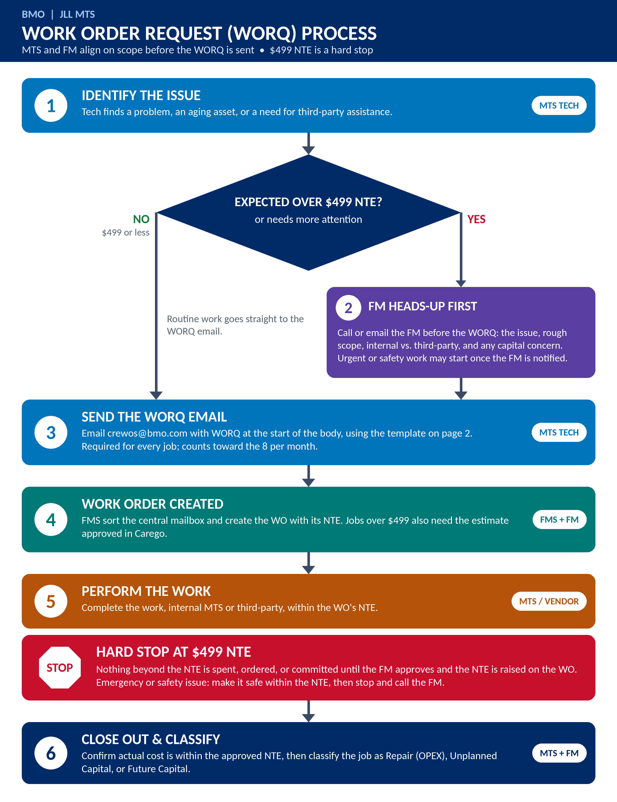

# Work Order Request (WORQ) Process

**BMO | JLL MTS**
The WORQ itself is the FM's heads-up • $499 NTE is a hard stop

> **Updated since v4 (pictured above):** the separate "call the FM before submitting" step has been dropped. The WORQ email now carries full detail up front — location, cost, condition, the tech's repair/replace and capital-type recommendation — so the FM can decide how to handle it from the submission itself, without a prior call. The tech isn't the final decision-maker on vendor, repair-vs-replace, or capital classification — those are recommendations the FM confirms. The steps and template below reflect the current process; the diagram above is kept for historical reference.

## Page 1 — Process Steps

| # | Step | Owner | Description |
|---|------|-------|-------------|
| 1 | Identify the Issue | MTS Tech | Tech finds a problem, an aging asset, or a need for third-party assistance. |
| 2 | Send the WORQ Email | MTS Tech | Email `crewos@bmo.com` with **WORQ** at the start of the body, using the template below. Required for every job; counts toward the 8 per month. Jobs over $499 NTE are flagged in the email itself so the FM knows to review before work proceeds. |
| 3 | Work Order Created | FMS + FM | FMS sort the central mailbox and create the WO with its NTE. Jobs over $499 also need the estimate approved in Carego. |
| 4 | Perform the Work | MTS / Vendor | Complete the work, internal MTS or third-party, within the WO's NTE. |
| STOP | Hard Stop at $499 NTE | — | Nothing beyond the NTE is spent, ordered, or committed until the FM approves and the NTE is raised on the WO. Emergency or safety issue: make it safe within the NTE, then stop and call the FM. |
| 5 | Close Out & Classify | MTS + FM | Confirm actual cost is within the approved NTE, then classify the job as Repair (OPEX), Unplanned Capital, or Future Capital. |

## Page 2 — WORQ Email Template

**To:** `crewos@bmo.com`
**Body starts with:** `WORQ`

The FMS use these fields to create the work order. Shaded fields are new additions.

| Field (copy into the email) | Why it matters |
|---|---|
| Location: | Site the work is for. |
| FM: | Facility Manager for the site. |
| Priority (Rush, Normal): | Sets urgency for the FMS. |
| WO Description: | What is wrong and the work needed. |
| NTE: | Not-to-exceed amount. $499 is the standard; anything over needs FM approval before work proceeds. |
| Recommended Vendor: | Tech's suggested third-party vendor, if any — the FM decides who's actually used. |
| Asset / Equipment (unit, model/serial): | Identifies the exact equipment for tracking and capital planning. Not needed when Resource needed is Third-party. |
| Resource needed (Internal MTS / Third-party / Not sure): | Shows whether the request is a labor assignment or a vendor spend. |
| Repair or Replace: | Tech's recommendation; drives the OPEX vs. capital decision, FM has final say. |
| Labor & Materials estimate: | Breaks out the cost behind the NTE. |
| Age / condition of asset: | Approximate age; failing, degraded, or fine. |
| Remaining life estimate: | Rough range. Feeds future capital planning. |
| Capital type (Repair / Unplanned Capital / Future Capital): | Tech's recommendation; FM confirms. |
| Photos attached (Y/N): | Lets the FM and FMS review scope without a site visit. |

### Job Classification

| Type | Definition |
|---|---|
| Repair (OPEX) | Restores existing equipment to working order. Funded from the operating budget. |
| Unplanned Capital | Failed or failing equipment that must be replaced now and is not in the capital plan. |
| Future Capital | Aging or end-of-life equipment that is still running. Logged to feed FM's capital planning; no work needed yet. |

### Key Rules

- **Hard stop at $499 NTE.** Nothing beyond the NTE is spent, ordered, or committed until the FM approves and the NTE is raised on the WO.
- **Safety first.** In an emergency or safety situation, make it safe within the NTE, then stop and call the FM.
- **The WORQ email is the heads-up.** No separate pre-submission call is required — the email carries enough detail (cost, condition, recommendation) for the FM to decide how to handle it.
- **Techs recommend, FMs decide.** Vendor, repair-vs-replace, and capital type are the tech's best judgment on the ground, not the final call — the FM confirms each at review or close-out.
- **Every job goes through WORQ.** Email `crewos@bmo.com` with WORQ at the start of the body. Jobs over $499 also need the estimate approved in Carego.
- **Every job is classified** as Repair, Unplanned Capital, or Future Capital before close-out.

This process improves financial accountability, spend visibility, capital tracking, and governance compliance.

## Open Questions for FM Review

These were raised with the FM (Van) alongside the v4 flowchart and are not yet resolved in this document:

1. On bigger jobs, does the Carego estimate get approved before the work order is produced, or is the WO produced first and the estimate follows?
2. Does the $499 threshold include internal labor, or just materials/vendor cost?
3. Expected turnaround time for approving requests over $499, so expectations can be set with the techs.
